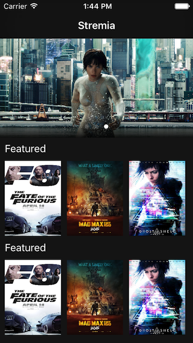
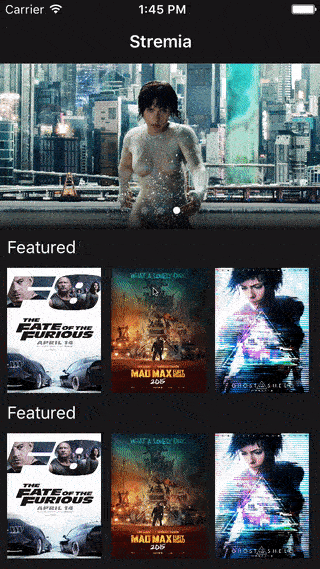

<h3 align="center">
  S T R E A M I A
</h3>

<h3 align="center">
  
</h3>

S T R E A M I A
============
`S T R E A M I A` is an example project of client application of `VOD` and `LIVE` streaming services like `Netflix` or `Amazon Prive Video` and is intented to showcase most of the important Frameworks of iOS.

This project is still in progress and more features will be added bi weekly.

## Feedback
If you want to provide feedback or ask a question please let me know at jonathan.fuentesf@gmail.com

|          |  features  |
|----------|------------|
:telescope: | Core Spotlight
:thought_balloon: | Protocol oriented programming
:floppy_disk: | Core Data ( work in progress )
:tv: | Picture-In-Picture (PiP) ( work in progress )
:point_down: | Force Touch ( work in progress )
:arrow_forward: | Custom Player ( work in progress )
:key: | Authentication ( work in progress )
:tv: | Airplay ( work in progress )
:tv: | Chromecast support ( work in progress )
:pencil2: | Multitasking ( work in progress )

## Core Spotlight
Taking advantage of this new feature integrated in iOS 9 whenever an user navigates to the detail page of a `Movie` or `Series` this will be indexed and it would be availabe for search in Spotlight search of iOS, through deep linking user is going to be able to see this content when tapping on Spotlight search results.

<h3 align="center">
  
</h3>

## Protocol oriented programming

- `Playable`: Ensures that any class that conforms it will have the necesary properties needed in order to playback content.

- `Media`: Used to set the all the properties needed in the model that the UI uses to show the content metadata and images.

## Core Data
Work in progress

## Picture-In-Picture (PiP) ( work in progress )
Work in progress

## Force Touch 
Work in progress

## Custom Player
Work in progress

## Authentication
Work in progress

## Airplay
Work in progress

## Chromecast support
Work in progress